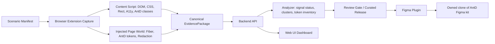

# Anthena — System Status Report

Generated: 2026-07-07, Asia/Saigon

## Executive summary

Anthena is now usable at the integration-shell level:

- Web UI is publicly reachable at `https://anthena.jultee.io.vn/`.
- Figma plugin artifact is buildable, packaged, and has the Figma manifest/runtime fixes required for manual loading.
- Browser extension is buildable and passes real unpacked-extension E2E, including MV3 service worker load, content script response, canonical evidence upload, redaction, screenshots, and multi-route/state provenance.
- Local backend/API v2 implementation passes the automated suite.

The main architectural caveat: production on ZimaOS is currently serving the Web UI through the legacy deployed backend. The local repo contains and tests `/api/v2`, but the ZimaOS container currently returns `404` for authenticated `/api/v2/evidence` and `/api/v1/runs`. Treat v2 as locally implemented and verified, not yet production-deployed.

## Current acceptance status

| Item | Status | Evidence |
|---|---:|---|
| Web UI accessible through `anthena.jultee.io.vn` | PASS | `GET /` returns `200 text/html`; static JS asset returns `200 application/javascript`; `GET /health` returns `200`; unauthenticated `GET /api/runs` remains `401` |
| Figma plugin loads in Figma | PASS, user-confirmed + artifact verified | Source manifest points to bundled `dist/code.js` / `dist/ui.html`; `networkAccess.allowedDomains=["none"]`; dist runtime has `require_count=0`; plugin tests `34/34` pass; package zip generated |
| Browser extension loads in browser | PASS, user-confirmed + automated E2E verified | `npm run build` succeeds; real unpacked-extension E2E passes; MV3 service worker loaded; content script responds; multi-route E2E passes |
| Web UI local build | PASS with warning | `npm run build` succeeds; Vite warns about a chunk >500 kB |
| Backend local tests | PASS with skipped production infra tests | `324 passed`, `6 skipped`; skipped tests are Postgres/MinIO connectivity/production adapter |
| Production API v2 | NOT DEPLOYED | Authenticated checks inside production container: `/api/runs` → `200`; `/api/v2/evidence` → `404`; `/api/v1/runs` → `404` |

## Zoom-out system map

### Module/caller view

| Layer | Main modules | Caller / consumer | Current state |
|---|---|---|---|
| Capture package | `extension/src/content/*`, `extension/src/injected/*`, `extension/src/background/evidence-assembler.js` | Extension popup/service worker | Automated real-extension E2E confirms actual MV3 load and package generation |
| Upload/API | `backend/src/v2/*`, legacy `backend/src/api/routes.js` | Extension upload client, Web UI | v2 passes local tests; production still exposes legacy API only |
| Analyzer | `backend/src/analyzer/*`, `backend/src/v2/*` processing logic | Backend API, Web UI review pages | Local tests cover signal status, clustering, token inventory, AntD precision |
| Review/Curated release | `backend/src/v2/routes.js`, Web UI review pages | Reviewer in Web UI | Implemented locally; production v2 not deployed yet |
| Figma sync | `figma-plugin/anthena-sync/*` | Figma plugin runtime | Build/package/test pass; manual load confirmed by user |
| Web dashboard | `web-ui/src/*`, static served by API container | Operators/reviewers | Production root loads over Cloudflare tunnel |
| Deployment shell | `/DATA/anthena`, Docker container `reverse-ds-api`, Cloudflare tunnel | Public domain | Stable for Web UI + legacy API; v2 deployment pending |

## Verification evidence

### Public Web UI

Verified from local machine against public domain:

| URL | Result |
|---|---|
| `https://anthena.jultee.io.vn/` | `200`, `text/html; charset=UTF-8` |
| `https://anthena.jultee.io.vn/health` | `200`, health JSON |
| `https://anthena.jultee.io.vn/assets/index-BWQxsjGM.js` | `200`, `application/javascript; charset=UTF-8` |
| `https://anthena.jultee.io.vn/api/runs` without auth | `401 Unauthorized` |

ZimaOS container health:

- Container: `reverse-ds-api`
- Public root issue was fixed by moving static Web UI serving before auth middleware.
- `/api/*` remains behind auth.
- Cloudflare tunnel was not changed.

### Figma plugin

Verified files:

- Source manifest: `figma-plugin/anthena-sync/manifest.json`
- Dist manifest: `figma-plugin/anthena-sync/dist/manifest.json`
- Package: `figma-plugin/anthena-sync/dist/figma-plugin.zip`

Checks:

- `npm test` in `figma-plugin`: `34 passed`
- `npm run build`: pass
- `npm run package`: pass
- Dist zip contains only `code.js`, `manifest.json`, `ui.html`
- Bundled `dist/code.js` contains no `require(...)`
- Manifest has `networkAccess.allowedDomains=["none"]`, so the previous Figma `networkAccess` manifest error is resolved
- Source manifest points to `dist/code.js` and `dist/ui.html`, so importing the source manifest directly is safe

### Browser extension

Verified files:

- Load unpacked from: `extension/dist`
- Manifest: `extension/dist/manifest.json`
- Root artifact also exists: `extension.zip`

Checks:

- `npm run build`: pass
- `npm test`: `47 passed`
- `npm run test:cross`: `51 passed`
- `npm run test:figma`: `34 passed`
- `npm run test:e2e`: PASS
  - built unpacked extension exists
  - actual MV3 service worker loaded
  - actual content script responds
  - `CAPTURE_NOW_V2` completed
  - DOM/CSS/rect/a11y/AntD evidence persisted
  - redaction applied by default
  - screenshot persisted
  - backend derives signal status from real data
- `npm run test:multi`: PASS
  - routes: `login`, `dashboard`, `settings`
  - states: `ready`, `loading`, `error`
  - 7 canonical packages persisted
  - provenance preserved
  - route/state separation verified

Warnings:

- Extension tests print Node module-type warnings because package files mix ES module syntax without `"type": "module"`. This does not block build/load, but should be cleaned up.
- Built icons are placeholder PNGs.

### Backend and analyzer

Local backend full suite:

- `npm test` in `backend`: `19 passed`, `1 skipped`
- Tests: `324 passed`, `6 skipped`

Important passed areas:

- v2 evidence API behavior
- idempotency
- signal status as real status strings, not booleans
- clustering
- release approve/publish/export flow
- token inventory and delta
- AntD v4/v5/v6 precision: aggregate precision `1.0`, 69 TP / 0 FP over fixtures
- custom component gate: rejects below threshold, accepts `>=3` instances across `>=2` scenarios with confidence and human approval

Skipped:

- Production Postgres/MinIO connectivity and production adapter tests. This means local logic is green, but production-grade storage topology is not proven in the current run.

### Web UI

Local Web UI build:

- `npm run build`: pass
- Warning: one Vite chunk exceeds 500 kB after minification.

Production Web UI:

- Public root serves HTML.
- Assets load.
- API remains protected.

Note: production appears to be serving an older built asset (`index-BWQxsjGM.js`) from the existing ZimaOS container. The local build generated newer asset names. If the latest local Web UI changes must be visible publicly, redeploy the latest `web-ui/dist` or rebuild the API image.

## Current capability statement

Anthena can currently:

1. Capture website UI evidence from a real browser extension:
   - DOM tree
   - computed CSS
   - bounding rects
   - accessibility evidence
   - Ant Design class evidence
   - AntD token probes where available
   - screenshot bytes
   - route/state provenance
   - default redaction

2. Convert raw capture into canonical EvidencePackage format.

3. Upload and validate canonical evidence through local `/api/v2` paths.

4. Derive signal reliability from actual data, including gaps/absent signals.

5. Cluster observed UI nodes and compute reviewable findings.

6. Detect AntD v4/v5/v6 class evidence with fixture-backed precision.

7. Enforce review gates for custom component promotion.

8. Build a Curated Release flow locally and export token/release structures.

9. Load a Web UI dashboard publicly through `anthena.jultee.io.vn`.

10. Load and run a Figma plugin artifact that can apply curated release JSON to an owned clone of a Figma kit.

## Gaps and risks

| Risk | Impact | Recommendation |
|---|---|---|
| Production still runs legacy API only | Web UI can load, but production cannot exercise `/api/v2` vertical slice yet | Deploy/rebuild production API with local v2 code after backing up ZimaOS |
| Postgres/MinIO tests skipped | Contract v2 target topology is not proven live | Bring up `docker-compose.v2.yml` or production storage stack and run skipped connectivity tests |
| Production static asset may be older than local build | Some Web UI changes may not be visible on domain | Rebuild/copy latest Web UI assets into production |
| Worktree is very dirty | Hard to distinguish feature work from deployment patch | Create a checkpoint commit or branch after review |
| SSH password was used for deployment | Credential exposure risk from interactive automation history | Rotate SSH/admin credentials |
| Extension icons are placeholders | Not production-polished UX | Replace placeholder icons |
| Web UI bundle has large chunk warning | Slower first load over public tunnel | Add route-level code splitting / chunk strategy |

## Recommended next sequence

1. Freeze the current passing local state with a checkpoint branch/commit.
2. Deploy v2 backend to ZimaOS in a controlled step:
   - backup `/DATA/anthena`
   - rebuild `reverse-ds-api` from current local repo
   - verify `/api/v2/evidence`, `/api/v1/runs`, `/`, `/health`
3. Bring up Postgres + MinIO topology and run the currently skipped tests.
4. Run one real route through the public path:
   - extension capture
   - upload to production `/api/v2`
   - analyzer/review
   - export curated release JSON
   - apply via Figma plugin dry-run, then apply to owned clone
5. Replace extension placeholder icons and address module-type warnings.
6. Rotate SSH/admin credentials after this deployment session.

## Final assessment

The system is now past the “can the shell pieces load?” milestone. Web UI, Figma plugin, and browser extension are all loadable, and the extension path has strong automated evidence. The design direction is still correct for the intended Anthena workflow, but the production deployment is one step behind the local architecture: v2 backend and Postgres/MinIO must be deployed/proven before the whole end-to-end contract v2 system can be called production-complete.
